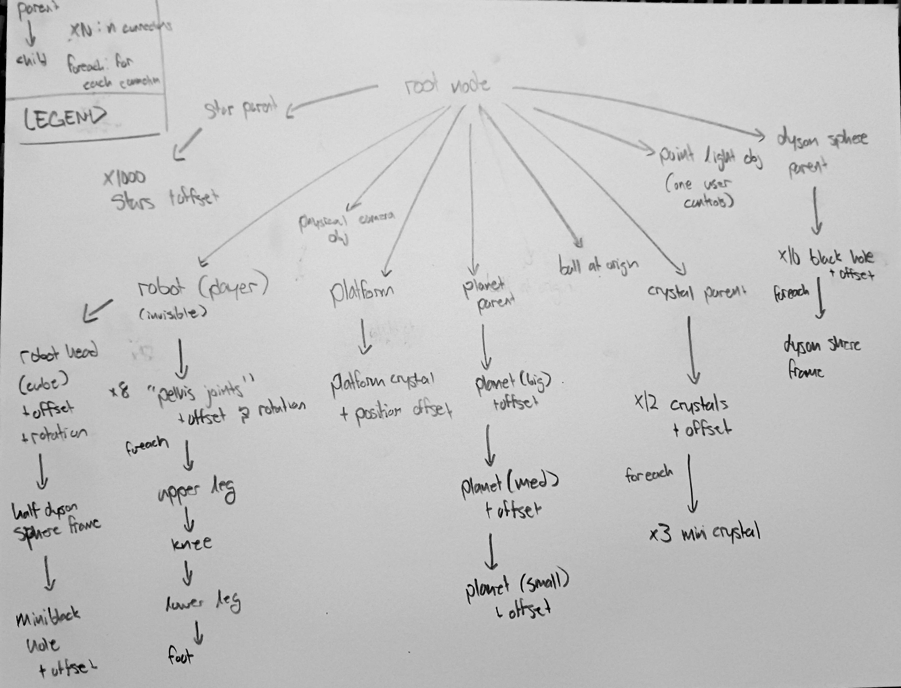

## A Space Disco
```
Author    : Evan Bertis-Sample
NetID     : eab0652
Date      : 3-13-2023
Course    : CS 351 - Introduction to Computer Graphics
Assignment: Project C - Berter Lighting and Materials
```


*A render of the final scene, featuring a cube robot with 8 legs on a platform that multiple dyson spheres orbit around, and a nice metalic ball in the center*

### Goals and Ambitions

For the past few projects, I had very naively hard-programmed lighting information into my shaders, for this project, my biggest objective was to make the lighting system more dynamic and flexible. I wanted to be able to change the lighting information in the scene without having to recompile the shaders. I also wanted to make the scene more complex, and add more models to the scene. I also wanted to make the scene more visually appealing, and add more color to the scene's lighting.

On top of that, I really wanted to include more rendering options. Previously, I only had a toggle that would switch between the Phong shading system and the debug mode, which showed the normals of the models. I wanted to add more options, such as options for the lighting models and the materials of the models. Luckily, both of these were a requirement for the project, so I was able to kill two birds with one stone.


### Scene Graph and Assemblies



*Pardon the poor quality of the picture.*

The scene graph had to be slightly simplified for drawing purposes. In essence, there are 9 main children of the parent node:

* The Star Parent (invisible)
* The Robot (player)
* Physical Camera Object (allows the camera to have a transform)
* The Platform
* The Planet Parent (invisible)
* The Ball at the Orign
* The Crystal Parent (invisible)
* The Point Light Object controlled by the user
* The Dyson Sphere Parent (invisible)

There are a few jointed assmblies in the scene, which are as follows:


 

1. The robot, which is made up of 8 legs, a body, and a head. Each leg is made out of 5 segments, and the body and head are made of 3 segments total.


2. The dyson spheres, which are made up of a black hole and a ring. These are joined together such that black hole is the parent of the ring. All dyson spheres are parented to an invisible object at the center of the scene, that constantly rotates.


1. Each crystal is comprised of 4 segments. The base, and the 3 surrounding crystals that orbit around the base. The base is the parent of the 3 surrounding crystals. All crystals are parented to an invisible object at the center of the scene, that constantly rotates.


5. The planet is combrised of 3 segments. The planet, it's moon, and the moon's moon. The planet is the parent of the moon, and the moon is the parent of the moon's moon. The planet is parented to an invisible object at the center of the scene, that constantly rotates.


### Help Guide

Running the project is simple. Just double click on the `Bertis-SampleEvan_ProjC.html` file, and it should open in your default web browser. The controls are as follows:


* **WASD** - Move to move the player character
* **Space** - Switch the camera mode for the left viewport
    * For the Follow mode, the camera will follow the robot
    * For the Free mode, the camera will be free to move around the scene, and can be controlled using the mouse and WASD. You can rotate the camera with Mouse Drag. You can also raise and lower the camera with Q and E.

All controls can be viewed by clicking the `Controls` button in the bottom left of the screen.

Additionally, there is a button in the bottom left of the screen (`Toggle Lighting`) that will toggle between the Phong shading system and the debug mode, which shows the normals of the models. This is useful for debugging the scene, and seeing how the lighting system works.

New to this project is a bunch of lighting controls, seperated into two sections.


Using these controls, you are able to modify some global lighting settings, particularly the lighting model used, and the attenuation function used. 

You can also choose to turn on/off the headlight, which is located at the camera's look at position.

In addition to this, you can change the materials of two objects in the scene: the sphere in the center of the scene, and the black whole inside of the player's head. I advise you try out the black hole material on the center sphere! You can see some cool vertex distortions.


Using these controls, you are able to modify the position and colors of the point light in the scene. You can also change the color of the ambient light in the scene.

### Results

Here are some screenshots of the scene from different angles:


## Lighting Model Comparisions


I am very happy with the results of this project. I was able to accomplish all of my goals, and I think the scene looks great. I was able to add a lot of color to the scene, and I was able to make the lighting system much more dynamic and flexible. I was also able to add more models to the scene, and make the scene more complex. I was also able to add more rendering options, and I think the scene looks great. I am very happy with the results of this project, and I think it is a great way to end the semester.
